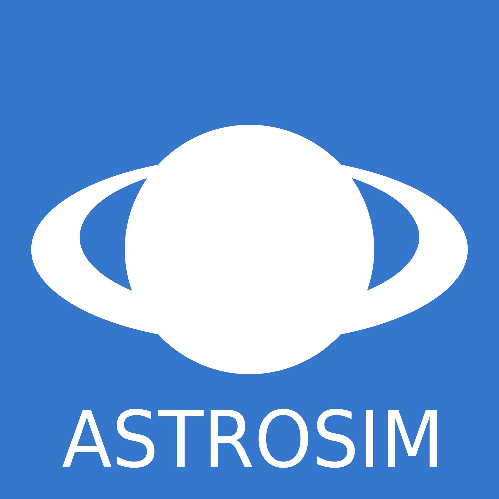

# AstroSim



A simulation of the movement of the planets - [https://petermader.github.io/astrosim](https://petermader.github.io/astrosim)

## Adding pre-defined scenes
You're welcome to contribute new scenes that are visible as "pre-defined scenes" in the scene dialog!

## Keyboard shortcuts
You can find a list of available keyboard shortcuts [here](hotkeys.md).

## Building the project
AstroSim uses [Browserify](http://browserify.org/), [Babel](http://babeljs.io/) and [UglifyJS2](https://github.com/mishoo/UglifyJS2). If you have downloaded this git repository and have the latest version of [node.js](https://nodejs.org) installed, you can just use:
```Shell
npm install
```
This will install all necessary tools to build AstroSim. On Windows, you can now run a build using:
```Batchfile
bin/build.bat
```
On Linux or Mac, you can run a build using:
```Shell
bin/build.sh
```
On Windows, you can run a debug build using:
```Batchfile
bin/build-debug.bat
```
On Linux or Mac, you can run a debug build using:
```Shell
bin/build-debug.sh
```
This will only run Browserify on the project, but will not use Babel to support older browsers, nor will it use UglifyJS to compress the result.
