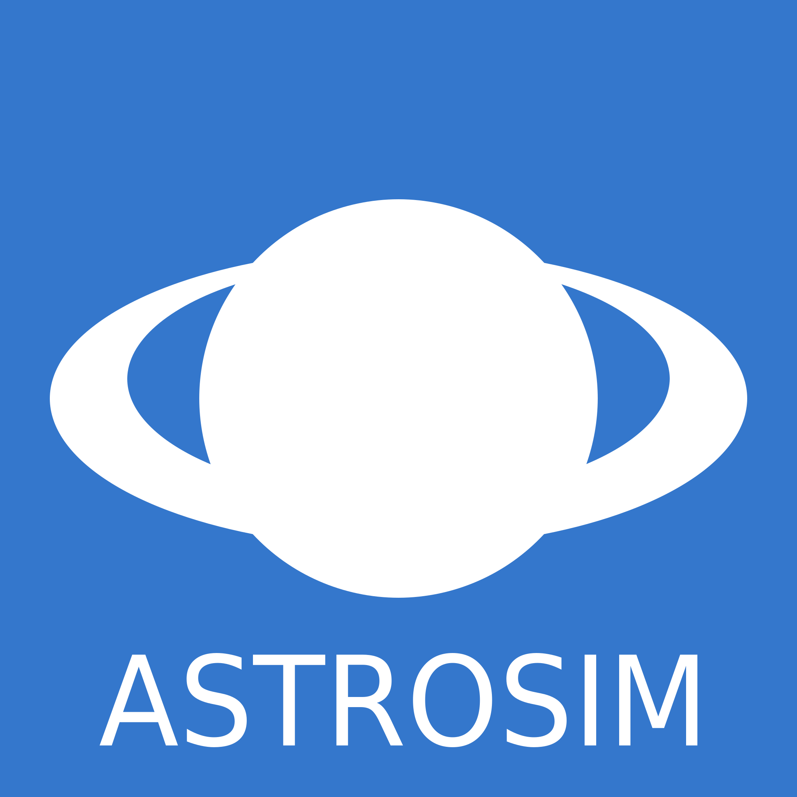

**Did you ever want to know what would happen if there was a second star in our solar system?**

AstroSim is a two-dimensional simulation of the movement of the planets. It simulates the gravity between the simulated objects. This makes the objects move towards each other. If you give them a start momentum, they will start to circle around each other just like real planets.

AstroSim is based on JavaScript and runs in the browser, which means that you do not have to install anything on your local computer.

Everything is measured in metric units: distance in meters, mass in kilograms. The time is accelerated, otherwise realistic simulations would take very much time.

List of all available [Hotkeys](hotkeys).
